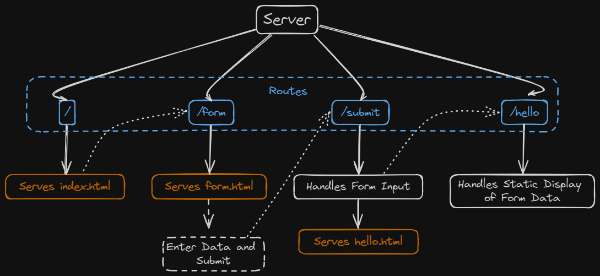

# goWebServer
# Creating a Web Server in Go

This comprehensive guide will take you through the process of creating a simple web server in Go, from setting up your project to understanding the code structure and execution. We'll cover essential concepts, such as handling routes, serving static files, parsing form data, and more. Let's get started!

## Prerequisites

Before diving into building the web server, make sure you have Go installed on your system. You can download and install Go from the official website: [https://golang.org/dl/](https://golang.org/dl/)

## Step 1: Project Setup

First, create a new directory for your project. Open your terminal and run the following commands:

```bash
mkdir web-server-go
cd web-server-go
```

## Step 2: Project Structure

In your project directory, create the following structure:

```
web-server-go/
├── static/
│   ├── form.html
│   └── hello.html
└── main.go
```

The `static` directory will hold our HTML files, and `main.go` will contain our main Go code.

## Step 3: Writing the Code

Open the `main.go` file in your preferred text editor and copy the provided code into it.

### Packages Used

The code utilizes several standard Go packages:

- `fmt`: Provides formatted I/O functions for printing messages to the console.
- `html/template`: Allows us to parse and execute HTML templates.
- `log`: Used for logging error messages to the console.
- `net/http`: Provides HTTP client and server implementations.

## Step 4: Understanding the Code

### Architecture



### Code Explanation

Let's break down the key components of the `main.go` file:
Let's delve deeper into the code explanation to understand each component and its role in building the web server.

### Code Structure Overview

The provided code is structured into several sections:

1. **Package Imports**: Import necessary packages from the Go standard library.
2. **Global Variables**: Declare global variables to store form data.
3. **Handler Functions**: Define HTTP handler functions for different routes.
4. **Main Function**: Set up the server, define routes, and start listening for incoming requests.

Now, let's examine each section in detail:

### 1. Package Imports

```go
import (
	"fmt"
	"html/template"
	"log"
	"net/http"
)
```

- **`fmt`**: Provides formatted I/O functions for printing messages.
- **`html/template`**: Allows parsing and executing HTML templates.
- **`log`**: Used for logging error messages to the console.
- **`net/http`**: Provides HTTP client and server implementations.

### 2. Global Variables

```go
var (
    name    string
    address string
)
```

- **`name`** and **`address`**: Global variables to store the submitted form data.

### 3. Handler Functions

#### a. `submitHandler`

```go
func submitHandler(w http.ResponseWriter, r *http.Request) {
    // Handle form submissions
    // Parse form data and update global variables
}
```

- **Responsibility**: Handles form submissions, parses form data, and updates global variables.
- **Method**: Uses the POST method to receive form submissions.
- **Flow**:
  - Checks if the request method is POST.
  - Parses form data using `r.ParseForm()` and stores it in global variables (`name` and `address`).
  - Redirects to `/hello` route after processing form data.

#### b. `formHandler`

```go
func formHandler(w http.ResponseWriter, r *http.Request) {
    // Serve the form page
}
```

- **Responsibility**: Serves the `form.html` file for users to input their data.
- **Method**: Uses the GET method to retrieve the form page.
- **Flow**:
  - Checks if the URL path is `/form`.
  - Serves the `form.html` file from the `static` directory.

#### c. `helloHandler`

```go
func helloHandler(w http.ResponseWriter, r *http.Request) {
    // Display a greeting message
}
```

- **Responsibility**: Displays a greeting message using the submitted data in `hello.html`.
- **Method**: Uses the GET method to retrieve the greeting page.
- **Flow**:
  - Checks if the URL path is `/hello`.
  - Parses the `hello.html` template, passing the global variables (`name` and `address`) as data.

### 4. Main Function

```go
func main() {
    // Set up the server and define routes
}
```

- **Responsibility**: Sets up the server, defines routes, and starts listening for incoming requests.
- **Flow**:
  - Registers handler functions for different routes (`/submit`, `/form`, `/hello`).
  - Serves static files from the `static` directory using `http.FileServer`.
  - Starts the server to listen on port 8080.

### Conclusion

Understanding each component of the code is crucial for building and maintaining a web server in Go. By breaking down the code into smaller, understandable parts, we gain insights into how the server processes requests, handles form submissions, serves static files, and more. This knowledge forms the foundation for developing more complex web applications in Go.
## Step 5: Running the Server

Navigate to your project directory in the terminal and run the following command to start the server:

```bash
go run main.go
```

You should see the message "Starting Server at port http://localhost:8080" printed in the terminal.

## Step 6: Testing the Server

1. Open a web browser and navigate to [http://localhost:8080](http://localhost:8080).
2. You'll land on the index page with a link to the form.
3. Click the link to go to the form page.
4. Fill out the form and submit it.
5. You'll be redirected to the hello page, where you'll see the submitted data displayed.

## Conclusion

Congratulations! You've successfully created a basic web server in Go. This guide provides a foundation for building more complex web applications. Experiment with the code, explore additional features, and continue learning to enhance your Go web development skills. Happy coding!